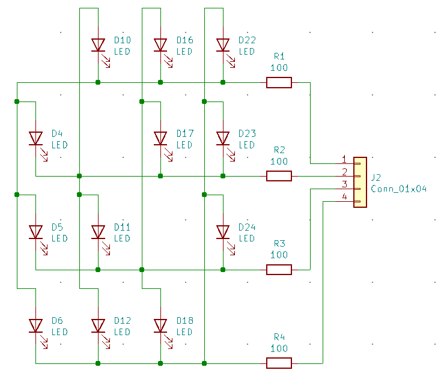

# CAROBOT Glowing Heart LED Kit

This repo contains the example code and the source files for the [CAROBOT Glowing Heart LED Kit](https://www.canadarobotix.com/products/2870).

## Example Code

[Example Arduino Code](https://github.com/carobot/CAROBOT-Glowing-Heart-LED-Kit/tree/main/carobot-glowing-heart)

## Circuit

The LED matrix circuit at a glance.

The board is designed to work with an [ATtiny85](https://www.canadarobotix.com/products/2770) which will be included in an upgraded version of the kit.
